# Quantum ROM (QROM)

Implementation and empirical analysis of Quantum Read-Only Memory oracles based on the SelectSwap network from [arXiv:1812.00954v2](https://arxiv.org/abs/1812.00954v2) (Low, Kliuchnikov, Schaeffer).

Given any classical function **f : F₂ⁿ → F₂ᵈ**, builds a quantum circuit **U** such that:

```
U |x⟩ₙ |0⟩ᵈ = |x⟩ₙ |f(x)⟩ᵈ
```

## Problem Statement

Quantum algorithms frequently need to load classical data into superposition. A QROM oracle maps each computational basis state |x⟩ to the corresponding data value |f(x)⟩. The naive approach (multi-controlled X gates for each address) costs O(2ⁿ · d) T-gates, which is prohibitively expensive for fault-tolerant quantum computing. The SelectSwap network trades ancilla qubits for a quadratic T-count reduction to O(√(2ⁿ · d)), but the tradeoff space is complex and parameter-dependent.

**This project answers**: For concrete values of n, d, and λ, what are the actual circuit costs after hardware decomposition? Where does SelectSwap outperform naive, and by how much?

## Implementations

### Naive (Select-only multiplexer) — `quantum_rom.py`

For each address x, applies multi-controlled X gates to write f(x) into the output register. No ancillas needed.

- **Qubits:** n + d
- **T-count:** O(2ⁿ · d)

### SelectSwap (paper's main contribution) — `quantum_rom.py`

Splits the address x = q·λ + r into quotient and remainder. **Select** (controlled by q) writes λ data values into λ ancilla registers simultaneously. **Swap** (controlled by r) routes the correct register to position 0. Uncomputation returns ancillas to |0⟩.

- **Qubits:** n + d + λ·d ancillas
- **T-count:** O(2ⁿ/λ + λ·d), optimized at λ = O(√(2ⁿ/d))
- **Optimal T-count:** O(√(2ⁿ · d)) — quadratic improvement

## Auto-Research Framework — `autoqrom/`

Beyond the paper's theoretical analysis, we built a systematic empirical framework that sweeps across all parameter combinations and measures real circuit costs after hardware-gate decomposition.

### What we measure (beyond the paper)

1. **Hardware-aware decomposition**: Every circuit is transpiled to a concrete basis gate set (`cx, u3, u2, u1, x, h`) and we measure post-decomposition depth and CNOT counts — the metrics that determine real device performance.

2. **Connectivity analysis**: We compute qubit connectivity density, unique 2-qubit gate pairs, and max fanout for every circuit — critical for mapping to limited-connectivity hardware (e.g., superconducting chips).

3. **Exhaustive lambda sweep**: Every valid power-of-2 lambda is tested (including degenerate cases λ=1 and λ=2ⁿ), revealing where the theoretical optimum breaks down at small n,d.

4. **Function-dependent variation**: Three structurally different test functions (bijection, identity, constant) reveal how function structure affects actual gate counts.

5. **Multi-objective Pareto analysis**: Pareto fronts across depth vs qubits and depth vs CNOTs identify optimal tradeoff configurations for different hardware constraints.

6. **Empirical scaling validation**: Log-log plots verify whether O(N·d) and O(√(N·d)) scaling predictions hold at concrete parameter values.

### Sweep Configuration

| Parameter | Range |
|---|---|
| Address qubits (n) | 2 – 8 |
| Data qubits (d) | 2 – 8 |
| Methods | naive, selectswap |
| Lambda values | 1, 2, 4, ..., 2ⁿ per (n,d) |
| Test functions | bijection, identity, constant |
| Total configurations | ~1,029 |

### Running the sweep

```bash
# Full sweep (n,d ∈ [2,8], ~45 min)
python3 -m autoqrom.sweep

# Quick test (n,d ∈ [2,3])
python3 -m autoqrom.sweep --small

# Generate all plots
python3 -m autoqrom.plots
```

## Key Results

### Verification

- **195 circuits verified** via statevector simulation (up to 24 qubits)
- **Zero verification failures** — every circuit correctly implements U|x⟩|0⟩ = |x⟩|f(x)⟩
- Circuits exceeding 24 qubits skip verification (statevector sim limit)

### SelectSwap vs Naive — Resource Comparison (bijection function)

| n | d | Naive Depth | Best SS Depth | Depth Reduction | Naive CNOT | Best SS CNOT | CNOT Reduction | Naive T | Best SS T | T Reduction | Best λ |
|---|---|---:|---:|---|---:|---:|---|---:|---:|---|---|
| 2 | 2 | 62 | 59 | 5% | 36 | 46 | -28% | 42 | 28 | **33%** | 2 |
| 3 | 2 | 303 | 129 | **57%** | 162 | 122 | **25%** | 168 | 84 | **50%** | 4 |
| 3 | 4 | 458 | 209 | **54%** | 246 | 236 | 4% | 280 | 168 | **40%** | 4 |
| 4 | 2 | 1,465 | 243 | **83%** | 864 | 274 | **68%** | 672 | 196 | **71%** | 8 |
| 4 | 3 | 1,553 | 323 | **79%** | 814 | 403 | **50%** | 896 | 294 | **67%** | 8 |
| 4 | 4 | 1,891 | 403 | **79%** | 1,006 | 532 | **47%** | 1,120 | 392 | **65%** | 8 |

### Key Findings

1. **SelectSwap wins decisively at n ≥ 3**: At n=4, SelectSwap achieves 79–83% depth reduction and 65–71% T-count reduction over naive.

2. **SelectSwap loses at small n relative to d**: At n=2 with d ≥ 4, the swap network overhead exceeds the savings. The naive approach is simpler and uses fewer CNOTs.

3. **Optimal λ tracks theory**: Empirically observed optimal λ values (2 for n=2, 4 for n=3, 8 for n=4) match the theoretical O(√(2ⁿ/d)) prediction.

4. **CNOT count doesn't always track T-count**: SelectSwap can reduce T-count while increasing CNOT count (e.g., n=2 d=2: 33% T reduction but 28% more CNOTs). Hardware choice determines which metric matters.

5. **The crossover point**: SelectSwap becomes advantageous when 2ⁿ > ~4·d. Below this threshold, naive is preferred.

## Plots

All plots are generated from sweep data and saved to `autoqrom/results/`.

### Circuit Depth vs Address Qubits
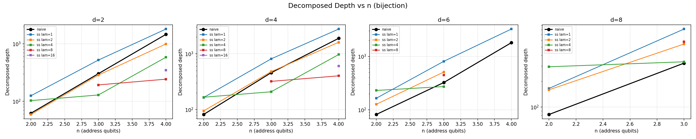

### CNOT Count vs Address Qubits
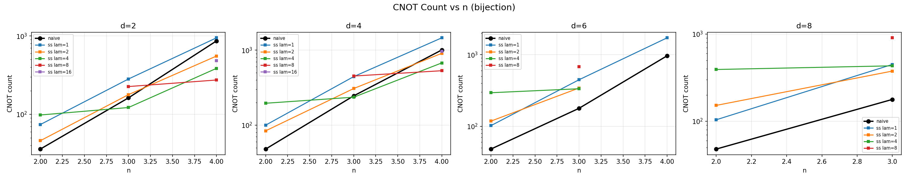

### T-count Estimate vs Address Qubits
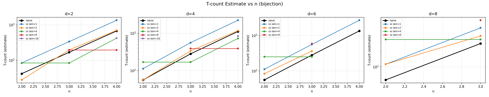

### Qubit Count vs Address Qubits
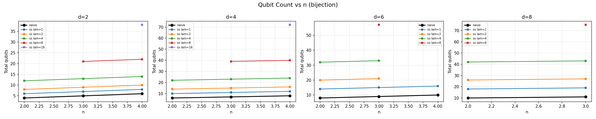

### Pareto Front: Depth vs Qubits
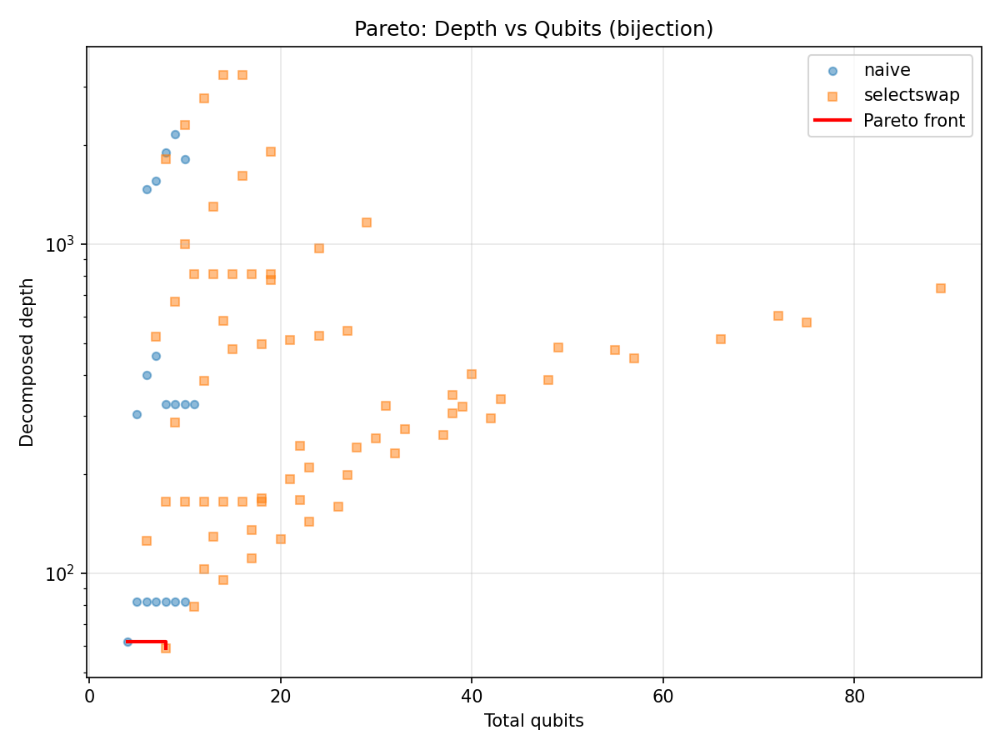

### Pareto Front: Depth vs CNOT Count
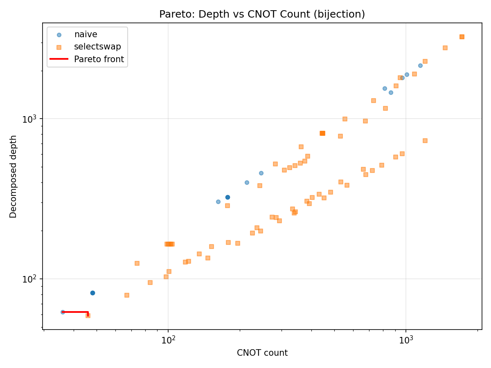

### Optimal Lambda Heatmap
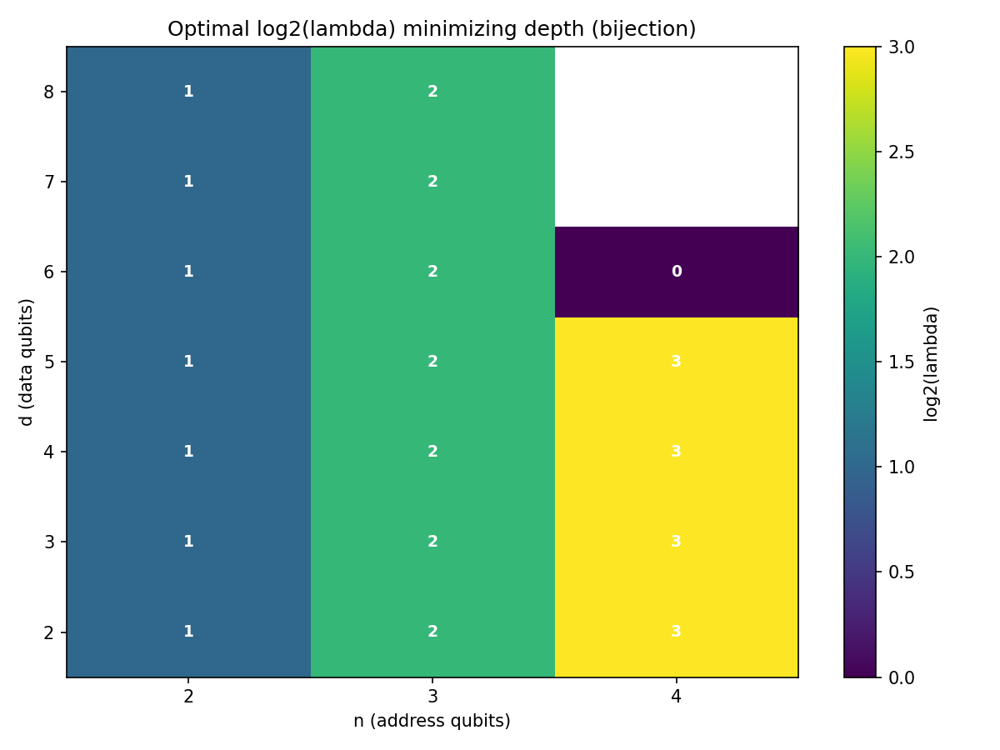

### Connectivity Density: Naive vs SelectSwap
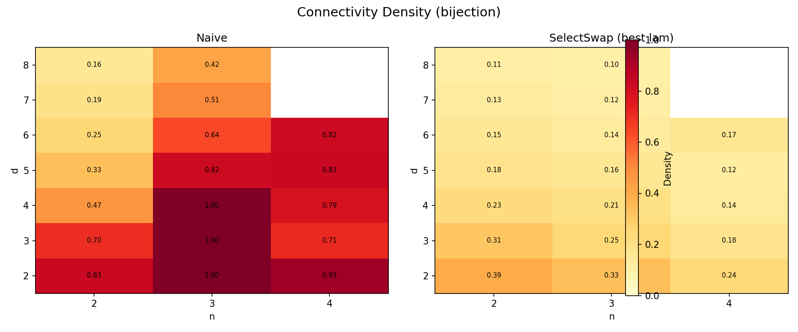

### Scaling Validation (Log-Log)
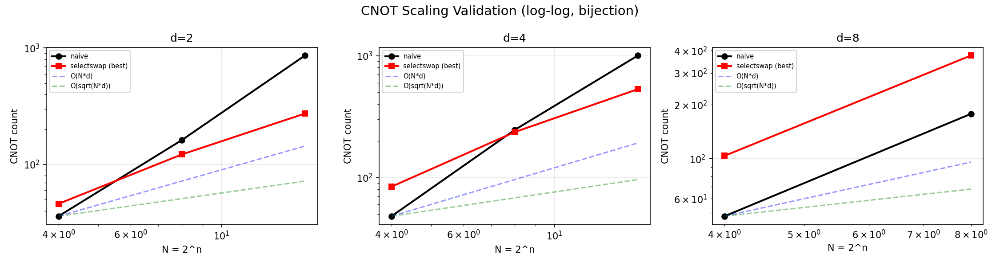

## Circuit Diagrams (n = d = 3)

### Naive QROM
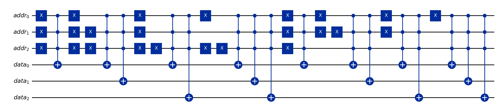

### SelectSwap QROM (λ = 2)
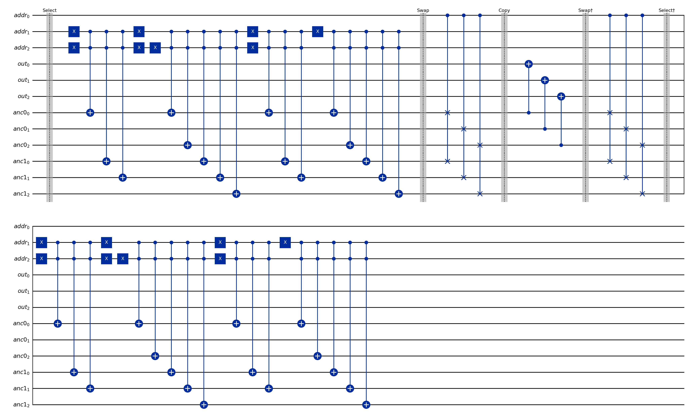

### SelectSwap QROM (λ = 4)
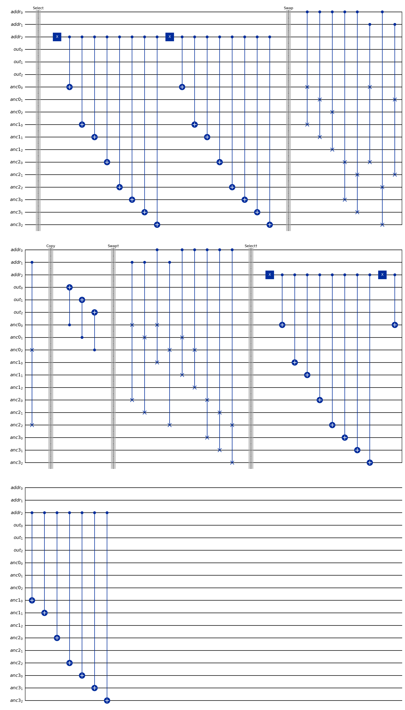

## Usage

```python
from quantum_rom import quantum_rom

# Define any function f : {0,..,2^n-1} -> {0,..,2^d-1}
f = lambda x: (2 * x + 1) % 8

# Naive approach
circuit = quantum_rom(f, n=3, d=3, method='naive')

# SelectSwap approach (auto-selects optimal λ)
circuit = quantum_rom(f, n=3, d=3, method='selectswap')

# SelectSwap with explicit λ
circuit = quantum_rom(f, n=3, d=3, method='selectswap', lam=2)
```

The function `f` can be a callable, list, or dict.

## Project Structure

```
quantum_rom.py              # Core QROM implementations (naive + SelectSwap)
demo.py                     # Verification demo for n=d=3
autoqrom/                   # Auto-research framework
  config.py                 #   Sweep parameters and constants
  functions.py              #   Test function library (bijection, identity, constant)
  metrics.py                #   Circuit metric extraction + connectivity analysis
  verify.py                 #   Statevector verification engine
  sweep.py                  #   Parameter sweep engine with crash resilience
  plots.py                  #   9 visualization types
  program.md                #   LLM agent instructions for exploration phase
  results/                  #   Output directory
    sweep_results.tsv        #     Raw sweep data
    *.png                    #     Generated plots
circuit_naive.png           # Circuit diagram: naive QROM
circuit_selectswap_lam2.png # Circuit diagram: SelectSwap λ=2
circuit_selectswap_lam4.png # Circuit diagram: SelectSwap λ=4
```

## Requirements

- Python 3.9+
- Qiskit 2.x (`pip install qiskit`)
- NumPy
- Matplotlib

## Reference

G. H. Low, V. Kliuchnikov, L. Schaeffer, "Trading T gates for dirty qubits in state preparation and unitary synthesis," *Quantum* **8**, 2024. [arXiv:1812.00954v2](https://arxiv.org/abs/1812.00954v2)
